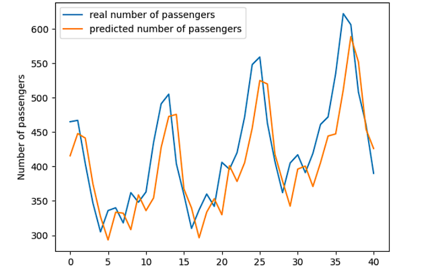

# Airline Passenger Prediction Using LSTM



## Project Overview
This project aims to predict the number of airline passengers for the upcoming month, given the number of passengers for the previous two months. The dataset consists of monthly totals of US airline passengers from 1949 to 1960, which is available on Kaggle. We use a Long Short-Term Memory (LSTM) model to make the predictions, leveraging its ability to learn and remember long-term dependencies in time series data.

## Dataset
The dataset used in this project is the **AirPassengers** dataset, which provides monthly totals of airline passengers in the US from 1949 to 1960. You can download the dataset from Kaggle [here](https://www.kaggle.com/chirag19/air-passengers).

## Model Architecture
The LSTM model architecture consists of:
- An LSTM layer with 128 memory blocks (neurons)
- A Dense layer with 64 memory blocks
- An output Dense layer with 1 neuron


## Installation
To run this project, you need to install the following dependencies:

```bash
pip install numpy==1.19
pip install pandas
pip install matplotlib
pip install tensorflow
pip install scikit-learn
```

## Results
Once the training is complete, the model predicts the number of airline passengers, and a graph comparing the real number of passengers with the predicted values is displayed.

